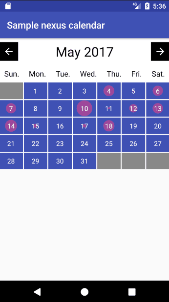

# Nexus Calendar
A Calendar library allow to visualize data between the months in different date. This library provided customization UI attributes for calendar.  

# Demo


## Installation

## Usage
Example:

```xml
<com.kslau.nexus.nexuscalendar.NexusCalendarView
        android:id="@+id/calendar"
        android:layout_width="match_parent"
        android:layout_height="match_parent"
        app:dayBackgroundColor="@color/colorPrimary"
        app:dayBlankBackgroundColor="@color/colorAccent"
        app:dayTextColor="@android:color/white"
        app:dayTextSize="12sp"
        app:dotColor="@color/colorAccent"
        app:headerArrowBackgroundColor="@android:color/black"
        app:headerBackgroundColor="@android:color/white"
        app:headerTextColor="@android:color/black"
        app:headerTextSize="28sp"
        app:layoutBackgroundColor="@android:color/background_light"
        app:weekTitleTextColor="@android:color/black" />
```

 - **init**
 ```
NexusCalendarView nexusCalendarView = (NexusCalendarView) findViewById(R.id.calendar);
```

 - **set Month**
 ```
nexusCalendarView.setCurrentMonth(7);
```

 - **set Year**
 ```
nexusCalendarView.setCurrentYear(2017);
```

 - **update UI**
 ```
nexusCalendarView.updateUI();
```
use this when exception case.

 - **add Dot**
 ```
nexusCalendarView.addDotValueToDate(11.9, new Date());
```

 - **set on click listener**
 ```
nexusCalendarView.setOnDateClickListener(new NexusCalendarView.OnDateClickListener() {
    @Override
    public void onDateClickListener(AdapterView<?> parent, View view, DayModel dayModel) {
	Toast.makeText(MainActivity.this, "on click - Date: " + dayModel.getDate(), Toast.LENGTH_SHORT).show();
    }
});
```
 - **set on long click listener**
 ```
 nexusCalendarView.setOnDateLongClickListener(new NexusCalendarView.OnDateLongClickListener() {
    @Override
    public boolean onDateLongClickListener(AdapterView<?> parent, View view, DayModel dayModel) {
	Toast.makeText(MainActivity.this, "on long click - Date: " + dayModel.getDate(), Toast.LENGTH_SHORT).show();
	return false;
    }
});
```
	
## ChangeLog
#1.0
- **initial version**

## License
```
MIT License

Copyright (c) 2017 Khai Shien Lau

Permission is hereby granted, free of charge, to any person obtaining a copy
of this software and associated documentation files (the "Software"), to deal
in the Software without restriction, including without limitation the rights
to use, copy, modify, merge, publish, distribute, sublicense, and/or sell
copies of the Software, and to permit persons to whom the Software is
furnished to do so, subject to the following conditions:

The above copyright notice and this permission notice shall be included in all
copies or substantial portions of the Software.

THE SOFTWARE IS PROVIDED "AS IS", WITHOUT WARRANTY OF ANY KIND, EXPRESS OR
IMPLIED, INCLUDING BUT NOT LIMITED TO THE WARRANTIES OF MERCHANTABILITY,
FITNESS FOR A PARTICULAR PURPOSE AND NONINFRINGEMENT. IN NO EVENT SHALL THE
AUTHORS OR COPYRIGHT HOLDERS BE LIABLE FOR ANY CLAIM, DAMAGES OR OTHER
LIABILITY, WHETHER IN AN ACTION OF CONTRACT, TORT OR OTHERWISE, ARISING FROM,
OUT OF OR IN CONNECTION WITH THE SOFTWARE OR THE USE OR OTHER DEALINGS IN THE
SOFTWARE.
```
